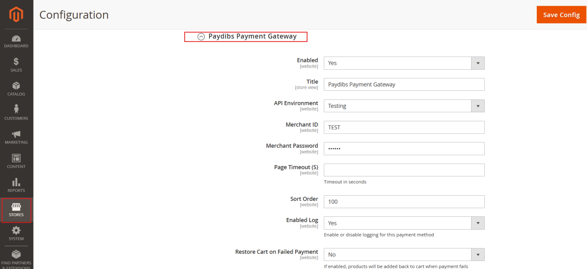
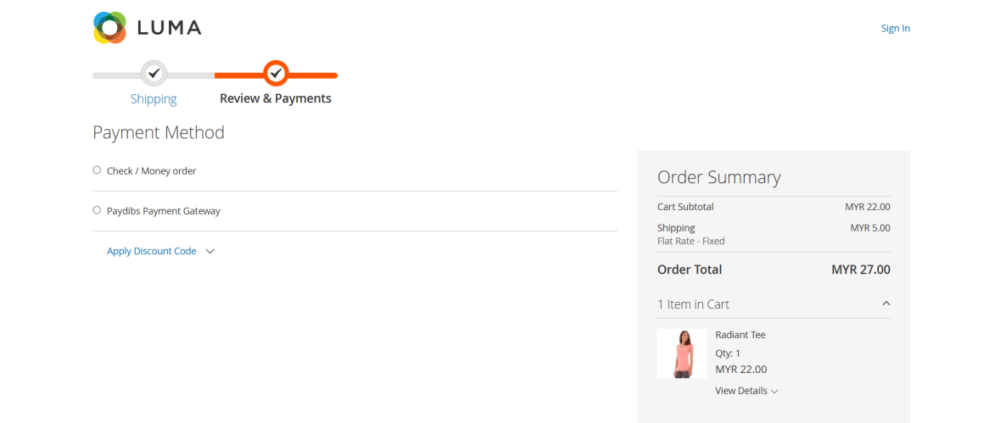
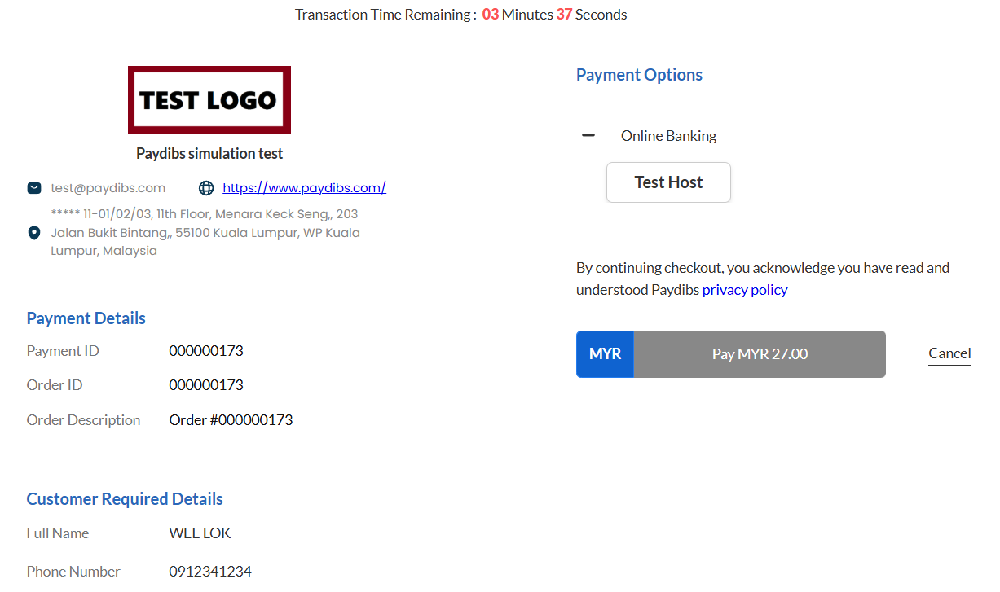
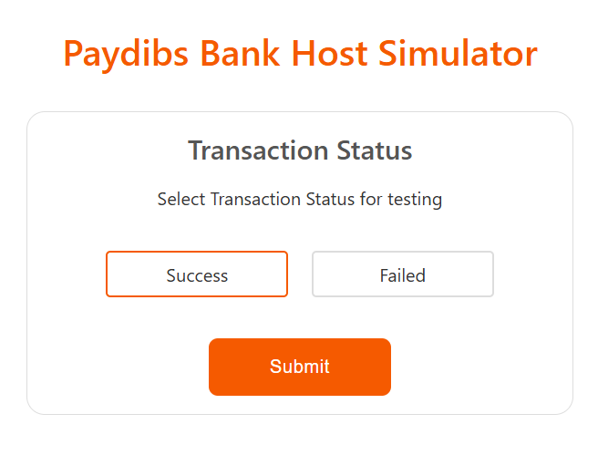
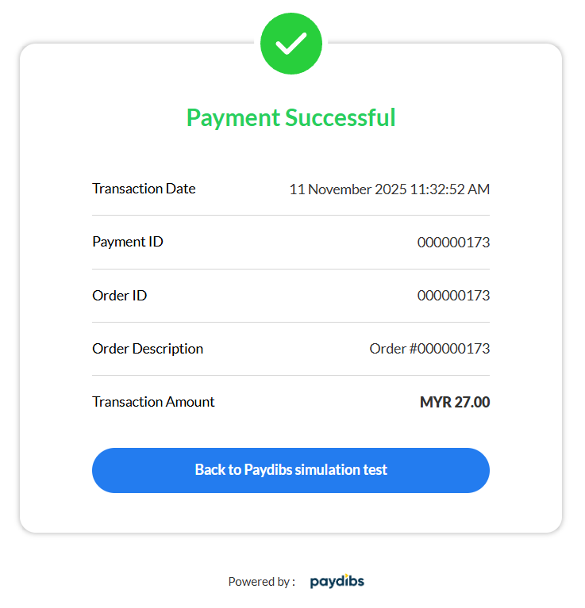
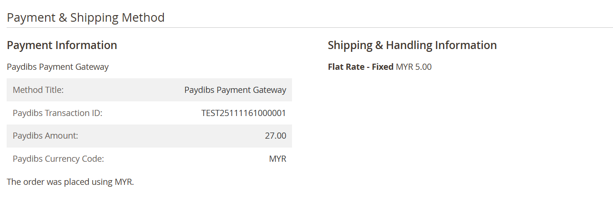

# Paydibs Payment Gateway — Adobe Commerce (on-prem & Cloud)

*Same Paydibs experience as our Open Source build, packaged for Adobe Commerce. Composer package: `paydibs/module-paymentgateway-commerce`.*


---

## Who this is for

This guide is for teams running **Adobe Commerce** (on-premises or **Commerce Cloud**). Behavior at checkout and in the admin matches what you already know from Magento—Paydibs is just another payment method, with hosted payment pages and server-to-server notifications behind the scenes.

---

## Requirements

- **Adobe Commerce 2.4.x** aligned with the extension’s `composer.json` constraints (`magento/framework` **~103.0.0||~104.0.0**, etc.).
- **PHP** per your Adobe Commerce version.
- **Paydibs** Test credentials for QA; switch to Production when you launch.

---

## Installing with Composer

From the Magento **project root** (the same place you run `bin/magento`):

```bash
composer require paydibs/module-paymentgateway-commerce
bin/magento module:enable Paydibs_PaymentGateway
bin/magento setup:upgrade
bin/magento setup:di:compile
bin/magento cache:flush
```

On **Commerce Cloud**, add the dependency in your normal **composer.json** workflow, commit, and deploy through your pipeline so `vendor/` is built on the integration/staging/production branches the way you always do—don’t copy `app/code` by hand unless that’s your house standard.

Confirm the module:

```bash
bin/magento module:status Paydibs_PaymentGateway
```

---

## Configuration (and scopes)

Open **Stores → Configuration → Sales → Payment Methods → Paydibs Payment Gateway**. The screen looks like this:



Use **website** or **store view** scope the same way you do for other payment methods: often you’ll set **Test** credentials on staging and **Production** on live, without touching code.

Fields in short: **Enabled**, **Title**, **API Environment**, **Merchant ID**, **Merchant Password** (encrypted at rest), **Page timeout**, **Sort order**, **logging**, **restore cart on failure**, and the optional **manual requery** secret for automated status checks.

---

## Storefront flow (what QA should click through)

Customers pick Paydibs on the payment step:



They’re redirected to Paydibs to pay:



In test environments you may use Paydibs’ simulator to choose outcomes:



Success is confirmed on Paydibs before return to your store:



---

## After checkout: what operations see

In the order, payment metadata from Paydibs appears with the order, for example:



Use this for finance and customer service the same way you would for any gateway reference.

---

## Reliability and background jobs

- **IPN / notify** — Paydibs calls your store server-to-server; keep your base URL and firewall rules consistent with Adobe’s deployment model (Cloud includes standard HTTPS endpoints).
- **Cron** — Pending Paydibs orders are rechecked on a **~15 minute** schedule; ensure Adobe Commerce cron is enabled in each environment where you take real traffic.
- **Manual requery** — Optional; set a secret in config only if your operations team needs the HTTP endpoint.

---

## License

Distributed under the **Apache License, Version 2.0** (`LICENSE.txt`, `NOTICE.txt` in the package root).

---

## Support

**Paydibs** for merchant and API questions. **Extension** issues: see `composer.json` `support` links. For Commerce Cloud infrastructure, follow Adobe’s runbooks—this module doesn’t change how you deploy, only adds a Composer dependency and configuration.
